<h1>实验报告</h1>

### 1. LeNet中哪些结构或思想在ResNet中仍然存在？哪些已经不用？

- 仍然存在
  1. LeNet全局平均池化，resnet也是
  2. 卷积层
  3. 全连接层
- 不用的：激活函数resnet使用RELU，Lenet使用的是sigmoid

### 2.	AlexNet对于LeNet做了哪些改进？

1. 池化层
   - 使用最大池化层 max pooling
   - 层叠池化：步长比池化的核的尺寸小，这样池化层的输出之间有重叠，提升了特征的丰富性
2. 使用数据增强
   - 镜像反射和随机剪裁
   - 改变训练样本RGB通道的强度值
3. 使用Dropout
   - Dropout操作会将概率小于0.5的每个隐层神经元的输出设为0，即去掉了一些神经节点，达到防止过拟合。
4. 使用ReLU激活函数
   - 加快收敛，防止过拟合
5. 使用LRN
   局部响应归一化（LRN）对局部神经元的活动创建竞争机制，使得其中响应比较大的值变得相对更大，并抑制其他反馈较小的神经元，增强了模型的泛化能力。
6. 网络层数增加
7. 多GPU并行训练

### 3.	这些改进中，有哪些在ResNet中仍然存在？哪些又舍弃了？

- 被舍弃
  1. 层叠池化
  2. 卷积之后的maxpooling换成了Avgpooling
  3. dropout
  4. LRN
- 仍然使用
  1. Relu激活
  2. padding:resnet的3*3的卷积层有
  3. maxpooling：输入之后con_2d层前有一个3*3的maxpooling，推测是减少计算量的，相当于低通滤波;其实alexnet的torch代码中也有avgpooling，但是它们都不是提取特征的关键层。
  4. 数据增强
  5. 网络层数加深

### 4.	如果再把舍弃的改进加回ResNet，会有什么样的实验表现？请挑选一处，在Tiny-ImageNet数据集上做实验，给出量化分析

- 在resnet中，alexnet被抛弃的最大的部分是原有的分类器。alexnet使用dropout层配合两层全连接网络避免过拟合并实现分类，而resnet抛弃了dropout，而是用起了全局平均池化来实现改变通道数和避免过拟合，从而替代了dropout+全连接网络。

#### 设置对照试验

- 对照组1：resnet18（记作resnet_origin）
- 对照组2：resnet50（记作resnet50_origin）
- 实验组1：将resnet18最后的全局平均池化替换成全局最大池化（记作resnet_maxpool）
- 实验组2：将resnet18最后的分类器(全局最大池化+全连接层)替换成alexnet的分类器(maxpooling+ReLU激活+全连接网络)*2（记作resnet_maxpool）
- 实验组3：将resnet50最后的全局平均池化替换成全局最大池化（记作resnet50_maxpool）
- 实验组4：将resnet50最后的分类器(全局最大池化+全连接层)替换成alexnet的分类器(maxpooling+ReLU激活+全连接网络)*2（记作resnet50_maxpool）
- 对照实验目的

  1. 对照组1与实验组1、对照组2与实验组3：讨论是全局最大池化好还是全局平均池化好
  2. 对照组1与实验组2、对照组2与实验组4：讨论alexnet与resnet的分类器差异
  3. 实验组1与实验组2、实验组3与实验组4：讨论使用了池化后还有没有必要使用全连接网络，使用是否会加剧过拟合现象
  4. 对照组1、实验组1、2与对照组2、实验组3、4：因为resnet18与resnet50的网络结构并不相同，探讨上面3个实验现象是否同时在 `BasicBlock`和 `Bottleneck`中出现。
- 对照实验实现
  修改torch中的resnet部分源码：

  - 网络对象属性定义处

  ```python
   if modify_type is MODIFY.ORIGIN:
      self.avgpool = nn.AdaptiveAvgPool2d((1, 1))
      self.fc = nn.Linear(512 * block.expansion, num_classes)
      print("use origin resnet")
   elif modify_type is MODIFY.MAXPOOL:
      self.maxpool2 = nn.AdaptiveMaxPool2d((1, 1))
      self.fc = nn.Linear(512 * block.expansion, num_classes)
      print("use resnet modified with maxpooling")
   elif modify_type is MODIFY.DROPOUT:
      self.classifier = nn.Sequential(
            nn.Dropout(p=0.5),
            nn.Linear(512* block.expansion * 2 * 2, 512 * block.expansion),
            nn.ReLU(inplace=True),
            nn.Dropout(p=0.5),
            nn.Linear(512 * block.expansion, 512 * block.expansion),
            nn.ReLU(inplace=True),
            nn.Linear(512 * block.expansion, num_classes),
      )
      print("use resnet modified with dropout and linear")  
  ```

  - forward处

  ```python
   if self.modify_type is MODIFY.ORIGIN:
      x = self.avgpool(x)
      x = torch.flatten(x, 1)
      x = self.fc(x)
   elif self.modify_type is MODIFY.MAXPOOL:
      x = self.maxpool2(x)
      x = torch.flatten(x, 1)
      x = self.fc(x)
   elif self.modify_type is MODIFY.DROPOUT:
      x = torch.flatten(x, 1)
      x = self.classifier(x)
  ```

#### 使用torchboard观察网络结构

- resnet18原有网络结构如左下，左下红框内部分放大了之后为右下图，即一个全局均值池化加一个全连接层，现在对右下的分类器部分进行魔改

<center class="half">
<figure>
      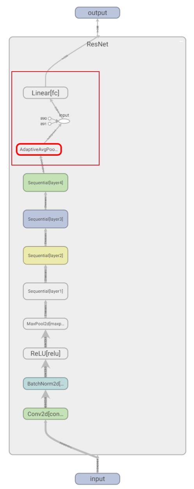
      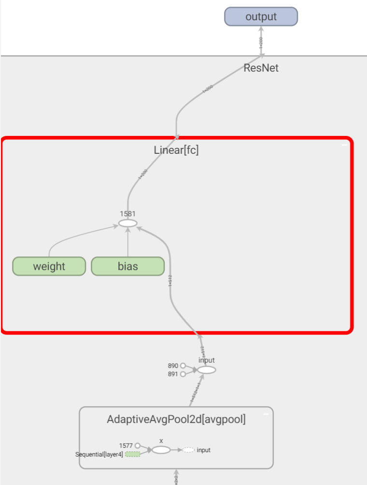
</figure>
</center>

- 魔改一（实验组1，3）：`全局最大池化`换 `全局平均池化`，网络结构左下图
- 魔改二（实验组2，4）：`两层dropout+relu激活+全连接`替换 `一层全局平均池化+一层全连接网络`,网络结构右下图

<center class="half">
<figure>
      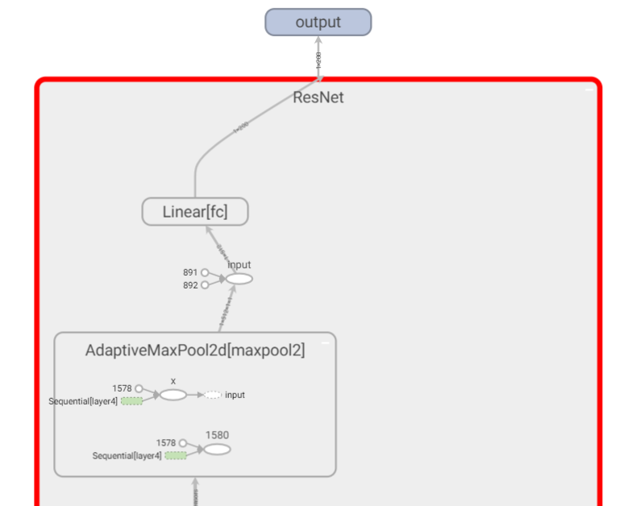
      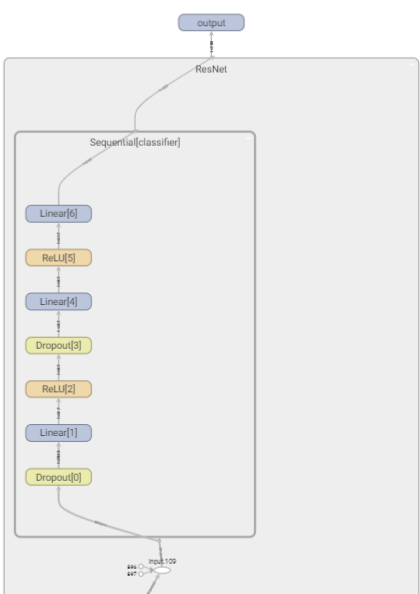
</figure>
</center>

#### 使用torchstat观察网络结构和计算性能

-  resnet18_origin和resnet_maxpool所得结果如下：

- 两者只用最后的pooling操作不同，计算性能相差不大
- <details>
   <summary>详细网络结构展开查看</summary>
   <pre><code>
   [MAdd]: AdaptiveAvgPool2d is not supported!
   [Flops]: AdaptiveAvgPool2d is not supported!
   [Memory]: AdaptiveAvgPool2d is not supported!
   D:\anaconda\anaconda3\envs\pytorch1.12\lib\site-packages\torchstat\reporter.py:63: FutureWarning: The frame.append method is deprecated and will be removed from pandas in a future version. Use pandas.concat instead.
   df = df.append(total_df)
                  module name  input shape output shape      params memory(MB)           MAdd          Flops  MemRead(B)  MemWrite(B) duration[%]   MemR+W(B)
   0                      conv1    3  64  64   64  32  32      9408.0       0.25   19,202,048.0    9,633,792.0     86784.0     262144.0       8.25%    348928.0
   1                        bn1   64  32  32   64  32  32       128.0       0.25      262,144.0      131,072.0    262656.0     262144.0       0.00%    524800.0
   2                       relu   64  32  32   64  32  32         0.0       0.25       65,536.0       65,536.0    262144.0     262144.0       0.00%    524288.0
   3                    maxpool   64  32  32   64  16  16         0.0       0.06      131,072.0       65,536.0    262144.0      65536.0       0.00%    327680.0
   4             layer1.0.conv1   64  16  16   64  16  16     36864.0       0.06   18,857,984.0    9,437,184.0    212992.0      65536.0       0.00%    278528.0
   5               layer1.0.bn1   64  16  16   64  16  16       128.0       0.06       65,536.0       32,768.0     66048.0      65536.0       0.00%    131584.0
   6              layer1.0.relu   64  16  16   64  16  16         0.0       0.06       16,384.0       16,384.0     65536.0      65536.0       0.00%    131072.0
   7             layer1.0.conv2   64  16  16   64  16  16     36864.0       0.06   18,857,984.0    9,437,184.0    212992.0      65536.0       8.30%    278528.0
   8               layer1.0.bn2   64  16  16   64  16  16       128.0       0.06       65,536.0       32,768.0     66048.0      65536.0       0.00%    131584.0
   9             layer1.1.conv1   64  16  16   64  16  16     36864.0       0.06   18,857,984.0    9,437,184.0    212992.0      65536.0       8.30%    278528.0
   10              layer1.1.bn1   64  16  16   64  16  16       128.0       0.06       65,536.0       32,768.0     66048.0      65536.0       0.00%    131584.0
   11             layer1.1.relu   64  16  16   64  16  16         0.0       0.06       16,384.0       16,384.0     65536.0      65536.0       0.00%    131072.0
   12            layer1.1.conv2   64  16  16   64  16  16     36864.0       0.06   18,857,984.0    9,437,184.0    212992.0      65536.0       8.32%    278528.0
   13              layer1.1.bn2   64  16  16   64  16  16       128.0       0.06       65,536.0       32,768.0     66048.0      65536.0       0.00%    131584.0
   14            layer2.0.conv1   64  16  16  128   8   8     73728.0       0.03    9,428,992.0    4,718,592.0    360448.0      32768.0       0.00%    393216.0
   15              layer2.0.bn1  128   8   8  128   8   8       256.0       0.03       32,768.0       16,384.0     33792.0      32768.0       0.00%     66560.0
   16             layer2.0.relu  128   8   8  128   8   8         0.0       0.03        8,192.0        8,192.0     32768.0      32768.0       0.00%     65536.0
   17            layer2.0.conv2  128   8   8  128   8   8    147456.0       0.03   18,866,176.0    9,437,184.0    622592.0      32768.0       8.29%    655360.0
   18              layer2.0.bn2  128   8   8  128   8   8       256.0       0.03       32,768.0       16,384.0     33792.0      32768.0       0.00%     66560.0
   19     layer2.0.downsample.0   64  16  16  128   8   8      8192.0       0.03    1,040,384.0      524,288.0     98304.0      32768.0       0.00%    131072.0
   20     layer2.0.downsample.1  128   8   8  128   8   8       256.0       0.03       32,768.0       16,384.0     33792.0      32768.0       0.00%     66560.0
   21            layer2.1.conv1  128   8   8  128   8   8    147456.0       0.03   18,866,176.0    9,437,184.0    622592.0      32768.0       0.00%    655360.0
   22              layer2.1.bn1  128   8   8  128   8   8       256.0       0.03       32,768.0       16,384.0     33792.0      32768.0       0.00%     66560.0
   23             layer2.1.relu  128   8   8  128   8   8         0.0       0.03        8,192.0        8,192.0     32768.0      32768.0       0.00%     65536.0
   24            layer2.1.conv2  128   8   8  128   8   8    147456.0       0.03   18,866,176.0    9,437,184.0    622592.0      32768.0       0.00%    655360.0
   25              layer2.1.bn2  128   8   8  128   8   8       256.0       0.03       32,768.0       16,384.0     33792.0      32768.0       0.00%     66560.0
   26            layer3.0.conv1  128   8   8  256   4   4    294912.0       0.02    9,433,088.0    4,718,592.0   1212416.0      16384.0       8.30%   1228800.0
   27              layer3.0.bn1  256   4   4  256   4   4       512.0       0.02       16,384.0        8,192.0     18432.0      16384.0       0.00%     34816.0
   28             layer3.0.relu  256   4   4  256   4   4         0.0       0.02        4,096.0        4,096.0     16384.0      16384.0       0.00%     32768.0
   29            layer3.0.conv2  256   4   4  256   4   4    589824.0       0.02   18,870,272.0    9,437,184.0   2375680.0      16384.0       0.00%   2392064.0
   30              layer3.0.bn2  256   4   4  256   4   4       512.0       0.02       16,384.0        8,192.0     18432.0      16384.0       0.00%     34816.0
   31     layer3.0.downsample.0  128   8   8  256   4   4     32768.0       0.02    1,044,480.0      524,288.0    163840.0      16384.0       0.00%    180224.0
   32     layer3.0.downsample.1  256   4   4  256   4   4       512.0       0.02       16,384.0        8,192.0     18432.0      16384.0       8.28%     34816.0
   33            layer3.1.conv1  256   4   4  256   4   4    589824.0       0.02   18,870,272.0    9,437,184.0   2375680.0      16384.0       8.41%   2392064.0
   34              layer3.1.bn1  256   4   4  256   4   4       512.0       0.02       16,384.0        8,192.0     18432.0      16384.0       0.00%     34816.0
   35             layer3.1.relu  256   4   4  256   4   4         0.0       0.02        4,096.0        4,096.0     16384.0      16384.0       0.00%     32768.0
   36            layer3.1.conv2  256   4   4  256   4   4    589824.0       0.02   18,870,272.0    9,437,184.0   2375680.0      16384.0       0.00%   2392064.0
   37              layer3.1.bn2  256   4   4  256   4   4       512.0       0.02       16,384.0        8,192.0     18432.0      16384.0       0.00%     34816.0
   38            layer4.0.conv1  256   4   4  512   2   2   1179648.0       0.01    9,435,136.0    4,718,592.0   4734976.0       8192.0       8.35%   4743168.0
   39              layer4.0.bn1  512   2   2  512   2   2      1024.0       0.01        8,192.0        4,096.0     12288.0       8192.0       0.00%     20480.0
   40             layer4.0.relu  512   2   2  512   2   2         0.0       0.01        2,048.0        2,048.0      8192.0       8192.0       0.00%     16384.0
   41            layer4.0.conv2  512   2   2  512   2   2   2359296.0       0.01   18,872,320.0    9,437,184.0   9445376.0       8192.0       0.00%   9453568.0
   42              layer4.0.bn2  512   2   2  512   2   2      1024.0       0.01        8,192.0        4,096.0     12288.0       8192.0       0.00%     20480.0
   43     layer4.0.downsample.0  256   4   4  512   2   2    131072.0       0.01    1,046,528.0      524,288.0    540672.0       8192.0       0.00%    548864.0
   44     layer4.0.downsample.1  512   2   2  512   2   2      1024.0       0.01        8,192.0        4,096.0     12288.0       8192.0       8.32%     20480.0
   45            layer4.1.conv1  512   2   2  512   2   2   2359296.0       0.01   18,872,320.0    9,437,184.0   9445376.0       8192.0       8.48%   9453568.0
   46              layer4.1.bn1  512   2   2  512   2   2      1024.0       0.01        8,192.0        4,096.0     12288.0       8192.0       0.00%     20480.0
   47             layer4.1.relu  512   2   2  512   2   2         0.0       0.01        2,048.0        2,048.0      8192.0       8192.0       0.00%     16384.0
   48            layer4.1.conv2  512   2   2  512   2   2   2359296.0       0.01   18,872,320.0    9,437,184.0   9445376.0       8192.0       8.40%   9453568.0
   49              layer4.1.bn2  512   2   2  512   2   2      1024.0       0.01        8,192.0        4,096.0     12288.0       8192.0       0.00%     20480.0
   50                   avgpool  512   2   2  512   1   1         0.0       0.00            0.0            0.0         0.0          0.0       0.00%         0.0
   51                        fc          512          200    102600.0       0.00      204,600.0      102,400.0    412448.0        800.0       0.00%    413248.0
   total                                                   11279112.0       2.10  297,162,552.0  148,746,240.0    412448.0        800.0     100.00%  49608512.0
   ============================================================================================================================================================
   </code></pre>
   </details>

  ```
  Total params: 11,279,112
  ------------------------------------------------------------------------------------------------------------------------------------------------------------
  Total memory: 2.10MB
  Total MAdd: 297.16MMAdd
  Total Flops: 148.75MFlops
  Total MemR+W: 47.31MB
  ```
- resnet_dropout所得结果如下：
- 多了一个全连接层，无论是参数量和内存占用以及计算要求均提高了不少
- <details>
  <summary>详细网络结构展开查看</summary>
  <pre><code>
  [MAdd]: Dropout is not supported!
  [Flops]: Dropout is not supported!
  [Memory]: Dropout is not supported!
  [MAdd]: Dropout is not supported!
  [Flops]: Dropout is not supported!
  [Memory]: Dropout is not supported!
  D:\anaconda\anaconda3\envs\pytorch1.12\lib\site-packages\torchstat\reporter.py:63: FutureWarning: The frame.append method is deprecated and will be removed from pandas in a future version. Use pandas.concat instead.
  df = df.append(total_df)
                 module name  input shape output shape      params memory(MB)           MAdd          Flops  MemRead(B)  MemWrite(B) duration[%]   MemR+W(B)
  0                      conv1    3  64  64   64  32  32      9408.0       0.25   19,202,048.0    9,633,792.0     86784.0     262144.0       4.35%    348928.0
  1                        bn1   64  32  32   64  32  32       128.0       0.25      262,144.0      131,072.0    262656.0     262144.0       4.35%    524800.0
  2                       relu   64  32  32   64  32  32         0.0       0.25       65,536.0       65,536.0    262144.0     262144.0       0.00%    524288.0
  3                    maxpool   64  32  32   64  16  16         0.0       0.06      131,072.0       65,536.0    262144.0      65536.0       4.34%    327680.0
  4             layer1.0.conv1   64  16  16   64  16  16     36864.0       0.06   18,857,984.0    9,437,184.0    212992.0      65536.0       4.35%    278528.0
  5               layer1.0.bn1   64  16  16   64  16  16       128.0       0.06       65,536.0       32,768.0     66048.0      65536.0       0.00%    131584.0
  6              layer1.0.relu   64  16  16   64  16  16         0.0       0.06       16,384.0       16,384.0     65536.0      65536.0       0.00%    131072.0
  7             layer1.0.conv2   64  16  16   64  16  16     36864.0       0.06   18,857,984.0    9,437,184.0    212992.0      65536.0       4.35%    278528.0
  8               layer1.0.bn2   64  16  16   64  16  16       128.0       0.06       65,536.0       32,768.0     66048.0      65536.0       0.00%    131584.0
  9             layer1.1.conv1   64  16  16   64  16  16     36864.0       0.06   18,857,984.0    9,437,184.0    212992.0      65536.0       0.00%    278528.0
  10              layer1.1.bn1   64  16  16   64  16  16       128.0       0.06       65,536.0       32,768.0     66048.0      65536.0       0.00%    131584.0
  11             layer1.1.relu   64  16  16   64  16  16         0.0       0.06       16,384.0       16,384.0     65536.0      65536.0       0.00%    131072.0
  12            layer1.1.conv2   64  16  16   64  16  16     36864.0       0.06   18,857,984.0    9,437,184.0    212992.0      65536.0       0.00%    278528.0
  13              layer1.1.bn2   64  16  16   64  16  16       128.0       0.06       65,536.0       32,768.0     66048.0      65536.0       0.00%    131584.0
  14            layer2.0.conv1   64  16  16  128   8   8     73728.0       0.03    9,428,992.0    4,718,592.0    360448.0      32768.0       0.00%    393216.0
  15              layer2.0.bn1  128   8   8  128   8   8       256.0       0.03       32,768.0       16,384.0     33792.0      32768.0       0.00%     66560.0
  16             layer2.0.relu  128   8   8  128   8   8         0.0       0.03        8,192.0        8,192.0     32768.0      32768.0       0.00%     65536.0
  17            layer2.0.conv2  128   8   8  128   8   8    147456.0       0.03   18,866,176.0    9,437,184.0    622592.0      32768.0       0.00%    655360.0
  18              layer2.0.bn2  128   8   8  128   8   8       256.0       0.03       32,768.0       16,384.0     33792.0      32768.0       0.00%     66560.0
  19     layer2.0.downsample.0   64  16  16  128   8   8      8192.0       0.03    1,040,384.0      524,288.0     98304.0      32768.0       0.00%    131072.0
  20     layer2.0.downsample.1  128   8   8  128   8   8       256.0       0.03       32,768.0       16,384.0     33792.0      32768.0       0.00%     66560.0
  21            layer2.1.conv1  128   8   8  128   8   8    147456.0       0.03   18,866,176.0    9,437,184.0    622592.0      32768.0       0.00%    655360.0
  22              layer2.1.bn1  128   8   8  128   8   8       256.0       0.03       32,768.0       16,384.0     33792.0      32768.0       0.00%     66560.0
  23             layer2.1.relu  128   8   8  128   8   8         0.0       0.03        8,192.0        8,192.0     32768.0      32768.0       0.00%     65536.0
  24            layer2.1.conv2  128   8   8  128   8   8    147456.0       0.03   18,866,176.0    9,437,184.0    622592.0      32768.0       0.00%    655360.0
  25              layer2.1.bn2  128   8   8  128   8   8       256.0       0.03       32,768.0       16,384.0     33792.0      32768.0       0.00%     66560.0
  26            layer3.0.conv1  128   8   8  256   4   4    294912.0       0.02    9,433,088.0    4,718,592.0   1212416.0      16384.0       0.00%   1228800.0
  27              layer3.0.bn1  256   4   4  256   4   4       512.0       0.02       16,384.0        8,192.0     18432.0      16384.0       0.00%     34816.0
  28             layer3.0.relu  256   4   4  256   4   4         0.0       0.02        4,096.0        4,096.0     16384.0      16384.0       0.00%     32768.0
  29            layer3.0.conv2  256   4   4  256   4   4    589824.0       0.02   18,870,272.0    9,437,184.0   2375680.0      16384.0       0.00%   2392064.0
  30              layer3.0.bn2  256   4   4  256   4   4       512.0       0.02       16,384.0        8,192.0     18432.0      16384.0       0.00%     34816.0
  31     layer3.0.downsample.0  128   8   8  256   4   4     32768.0       0.02    1,044,480.0      524,288.0    163840.0      16384.0       0.00%    180224.0
  32     layer3.0.downsample.1  256   4   4  256   4   4       512.0       0.02       16,384.0        8,192.0     18432.0      16384.0       0.00%     34816.0
  33            layer3.1.conv1  256   4   4  256   4   4    589824.0       0.02   18,870,272.0    9,437,184.0   2375680.0      16384.0       4.39%   2392064.0
  34              layer3.1.bn1  256   4   4  256   4   4       512.0       0.02       16,384.0        8,192.0     18432.0      16384.0       0.00%     34816.0
  35             layer3.1.relu  256   4   4  256   4   4         0.0       0.02        4,096.0        4,096.0     16384.0      16384.0       0.00%     32768.0
  36            layer3.1.conv2  256   4   4  256   4   4    589824.0       0.02   18,870,272.0    9,437,184.0   2375680.0      16384.0       8.69%   2392064.0
  37              layer3.1.bn2  256   4   4  256   4   4       512.0       0.02       16,384.0        8,192.0     18432.0      16384.0       0.00%     34816.0
  38            layer4.0.conv1  256   4   4  512   2   2   1179648.0       0.01    9,435,136.0    4,718,592.0   4734976.0       8192.0       8.69%   4743168.0
  39              layer4.0.bn1  512   2   2  512   2   2      1024.0       0.01        8,192.0        4,096.0     12288.0       8192.0       0.00%     20480.0
  40             layer4.0.relu  512   2   2  512   2   2         0.0       0.01        2,048.0        2,048.0      8192.0       8192.0       0.00%     16384.0
  41            layer4.0.conv2  512   2   2  512   2   2   2359296.0       0.01   18,872,320.0    9,437,184.0   9445376.0       8192.0      13.06%   9453568.0
  42              layer4.0.bn2  512   2   2  512   2   2      1024.0       0.01        8,192.0        4,096.0     12288.0       8192.0       0.00%     20480.0
  43     layer4.0.downsample.0  256   4   4  512   2   2    131072.0       0.01    1,046,528.0      524,288.0    540672.0       8192.0       0.00%    548864.0
  44     layer4.0.downsample.1  512   2   2  512   2   2      1024.0       0.01        8,192.0        4,096.0     12288.0       8192.0       0.00%     20480.0
  45            layer4.1.conv1  512   2   2  512   2   2   2359296.0       0.01   18,872,320.0    9,437,184.0   9445376.0       8192.0       4.35%   9453568.0
  46              layer4.1.bn1  512   2   2  512   2   2      1024.0       0.01        8,192.0        4,096.0     12288.0       8192.0       0.00%     20480.0
  47             layer4.1.relu  512   2   2  512   2   2         0.0       0.01        2,048.0        2,048.0      8192.0       8192.0       0.00%     16384.0
  48            layer4.1.conv2  512   2   2  512   2   2   2359296.0       0.01   18,872,320.0    9,437,184.0   9445376.0       8192.0       8.65%   9453568.0
  49              layer4.1.bn2  512   2   2  512   2   2      1024.0       0.01        8,192.0        4,096.0     12288.0       8192.0       0.00%     20480.0
  50              classifier.0         2048         2048         0.0       0.01            0.0            0.0         0.0          0.0       0.00%         0.0
  51              classifier.1         2048          512   1049088.0       0.00    2,096,640.0    1,048,576.0   4204544.0       2048.0      26.07%   4206592.0
  52              classifier.2          512          512         0.0       0.00          512.0          512.0      2048.0       2048.0       0.00%      4096.0
  53              classifier.3          512          512         0.0       0.00            0.0            0.0         0.0          0.0       0.00%         0.0
  54              classifier.4          512          512    262656.0       0.00      523,776.0      262,144.0   1052672.0       2048.0       4.36%   1054720.0
  55              classifier.5          512          512         0.0       0.00          512.0          512.0      2048.0       2048.0       0.00%      4096.0
  56              classifier.6          512          200    102600.0       0.00      204,600.0      102,400.0    412448.0        800.0       0.00%    413248.0
  total                                                   12590856.0       2.11  299,783,992.0  150,057,984.0    412448.0        800.0     100.00%  54878016.0
  ============================================================================================================================================================
  </code></pre>
  </details>

  ```
  Total params: 12,590,856
  ------------------------------------------------------------------------------------------------------------------------------------------------------------
  Total memory: 2.11MB
  Total MAdd: 299.78MMAdd
  Total Flops: 150.06MFlops
  Total MemR+W: 52.34MB
  ```

#### 性能对比

- loss收敛情况（resnet18下）
   - 图像说明：train_loss图左侧为右侧的平滑图，两者并无区别
   - 实验现象
      1. 训练集上的收敛速度：origin_model>maxpool_model>dropout_model
      2. 测试集上的收敛速度：origin_model>maxpool,origin_model>dropout_model
      3. 测试集上三者的loss均出现了先下降后上升的情况
      4. 训练集三者都收敛到了0
      5. 测试集最终loss:origin_model\< maxpool_model\< dropout_model
   - 结论：
       - 收敛速度：origin_model>maxpool_model>dropout_model
       - 收敛效果：三者都有一定程度的过拟合现象，但dropout_model更为明显


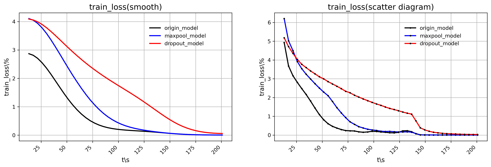
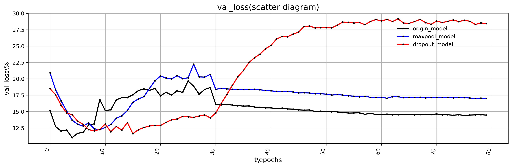

- accuracy情况（resnet18下）
  - 实验现象
   1. ACC1与ACC5均是：origin_model>maxpool_model>dropout_model
   2. ACC1：origin_model能达到35%，而maxpool_model与dropout_model相差不多，约31%
   3. ACC5:origin_model、maxpool_model、dropout_model三者分的较开，约50-60%
- ACC1
   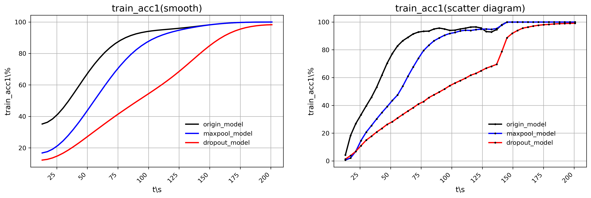
   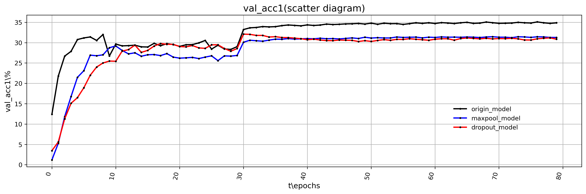
- ACC5
   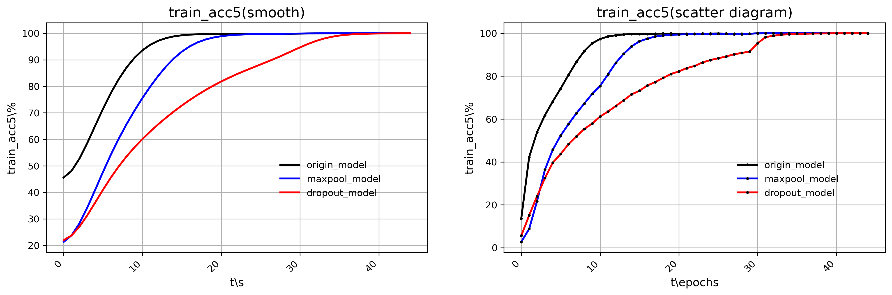
   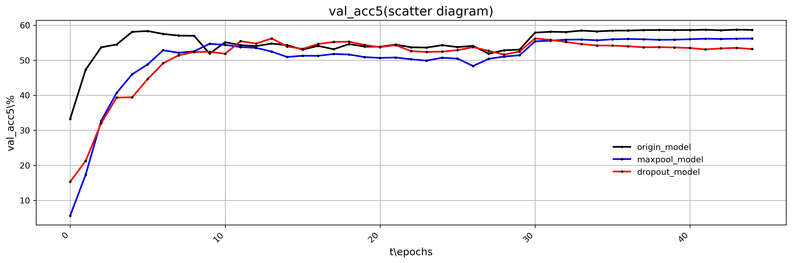

- f1度量（macro-F1）（resnet18下）
- 在样本不均匀时，考虑查准率和查全率的f1-score是更合适的，但是恰好使用的数据集`Tiny-ImageNet`专门弄得十分的均匀，每一类都是50张，所以这里的f1-score跟ACC1差不多：origin_model>maxpool_model>dropout_model
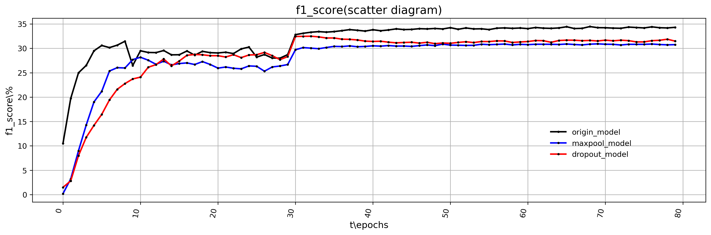

- 上述三个性能指标resnet18和resnet50现象差不多
  - 有趣的是在epoch较小时，使用`Bottleneck`的resnet50的dropout_model，在loss和accuray上都要优于maxpool_model，这反应了dropout_model的较多参数在初期可以较快的拟合，但是在后期会陷入过拟合的问题

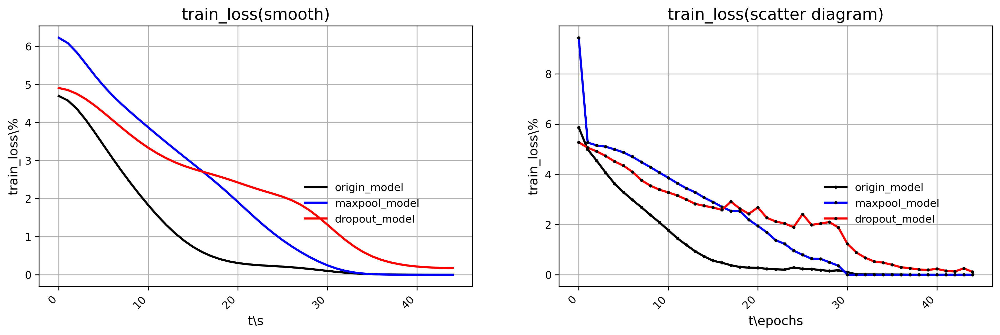
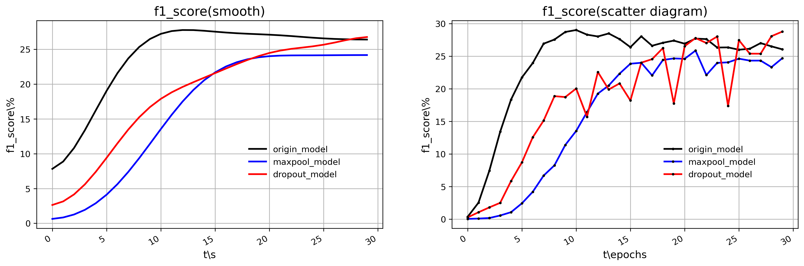

#### 实验结论
- resnet用全局平均池化替代了dropout+全连接网络，减少了参数量，提高了收敛速度，减弱了过拟合现象
- 同时用全局平均池化反映了被池化的4个参数的共同信息，没有像全局最大池化一样丢失信息，提高了收敛速度和准确率
-  `BasicBlock`和 `Bottleneck`中上述两点均成立
- dropout_model在epoch较小时acc和loss于epoch较大时相比要好不少，说明它的过拟合现象比较严重

#### 实验总结和心得体会
- 全连接网络的大量参数有可能会引起严重的过拟合，dropout也没救回来
- 实践出真知，debug一步一步看才搞懂了Tensor的通道数变化
- 看的懂原理不一定能看懂paper，看的懂paper不一定能看懂torch的源码（alexnet的结构源码和paper竟然不一样，），看得懂源码不一定能写对，
- 善用python的各种库
## 代码说明

### 复现要求

- 推荐使用第十一次实验时老师提供的远端机（我的代码都是在这上面跑的，github上的是下载备份），密码在老师第十一次的word讲义上
```
ssh root@202.38.95.226 -p 13234
```
我的目录
```
cd root\PB20030835
```
- 复现命令(`1> *.txt`加不加都行)
  - 运行resnet18_maxpool
  ```
  python main.py -a resnet18_maxpool --epoch=30 1> resnet18_maxpool.txt
  ```
  - 运行resnet18_dropout
  ```
  python main.py -a resnet18_dropout --epoch=30 1> resnet18_dropout.txt
  ```
  - 运行resnet18_origin
  ```
  python main.py -a resnet18 --epoch=30 1> resnet18_origin.txt
  ```
  - 运行resnet50_maxpool
  ```
  python main.py -a resnet50_maxpool --epoch=30 1> resnet50_maxpool.txt
  ```
  - 运行resnet50_dropout
  ```
  python main.py -a resnet50_dropout --epoch=30 1> resnet50_dropout.txt
  ```
  - 运行resnet50_origin
  ```
  python main.py -a resnet50 --epoch=30 1> resnet50_origin.txt
  ```
#### 代码结构
  - `main.py`和`my_models.py`一个是训练文件，一个是模型文件
  - `graph.ipnb`是解码输出的各个模型的`log.txt`,根据log作图
  - `runs`是tensorboard的生成文件夹
  - 以`_model`结尾的均是训练过程中产生的log文件

#### 区别已有和新增代码，大段新增代码已注释